# bài thực hành về user, group, file

1. Tạo 3 user(user-1, user-2, user-3), 2 group(groupA, groupB)

#### Create user:

sudo useradd -d /home/user-1 -m user-1

sudo passwd user-1

sudo useradd -d /home/user-2 -m user-2

sudo passwd user-2

sudo useradd -d /home/user-3 -m user-3

sudo passwd user-3

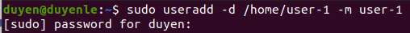

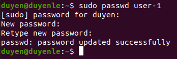

#### Create group:

sudo groupadd groupA

sudo groupadd groupB

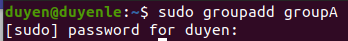

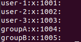

2. Cho user-1, user-2 vào groupA, user-3 vào groupB

#### Cho user-1, user-2 vao groupA

sudo usermod -a -G groupA user-1

sudo usermod -a -G groupA user-2

#### Cho user-3 vao groupB

sudo usermod -a -G groupB user-3

3. Tạo file-a cho user-1 được 3 quyền (read write execute) và groupA chỉ có quyền read

#### Create file-a.txt

touch file-a.txt

#### Doi chu so huu cua file-a.txt thanh user-1:groupA

sudo chown user-1:groupA file-a.txt

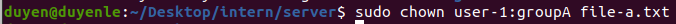

#### Cap quyen

sudo chmod 740 file-a.txt

#### Xem quyen

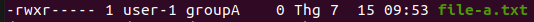

4. Connect SSH (dùng password) từ máy mình đến một máy bất kì trong mạng (upload 1 file từ máy mình và download 1 file về máy mình)

#### Connect

- username: user-1
- ip: 192.168.0.44

ssh user-1@192.168.0.44

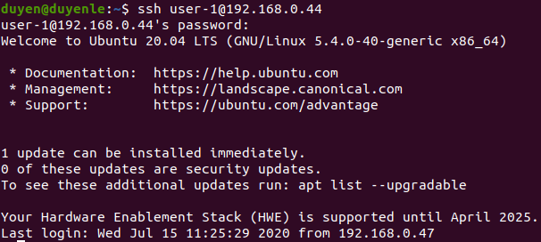

#### Upload folder duyen

scp -r duyen user-1@192.168.0.44:duyen

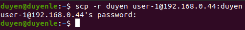

#### Download folder hang

scp -r user-1@192.168.0.44:hang hang

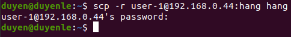

5. Tạo SSH key để đặng nhập vào server (một máy của bạn bất kì trong mạng) không dùng mật khẩu

#### Tao ssh key

ssh-keygen -t rsa -b 4096 -C "duyenle.24hdev@gmail.com"

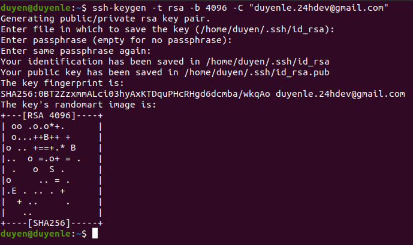

#### Thêm public key vào authorized_key trên server

cat ~/.ssh/id_rsa.pub | ssh user-1@192.168.0.44 "mkdir -p ~/.ssh && touch ~/.ssh/authorized_keys && chmod -R go= ~/.ssh && cat >> ~/.ssh/authorized_keys"

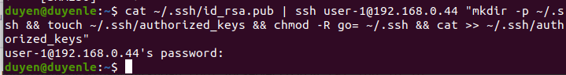

#### Connect

ssh -i ~/.ssh/id_rsa user-1@192.168.0.44

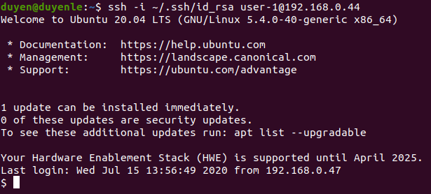
