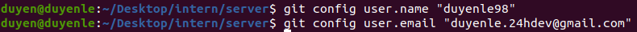
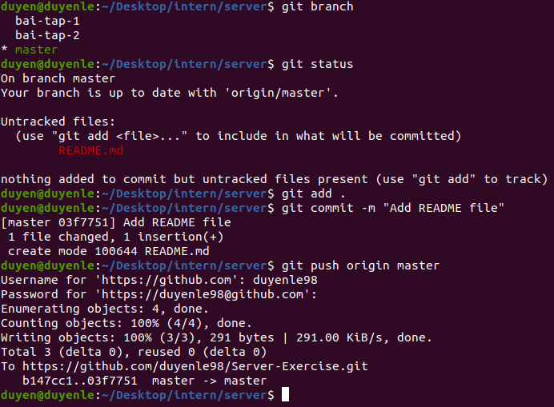
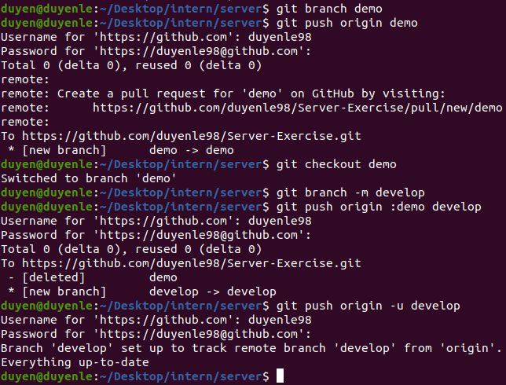
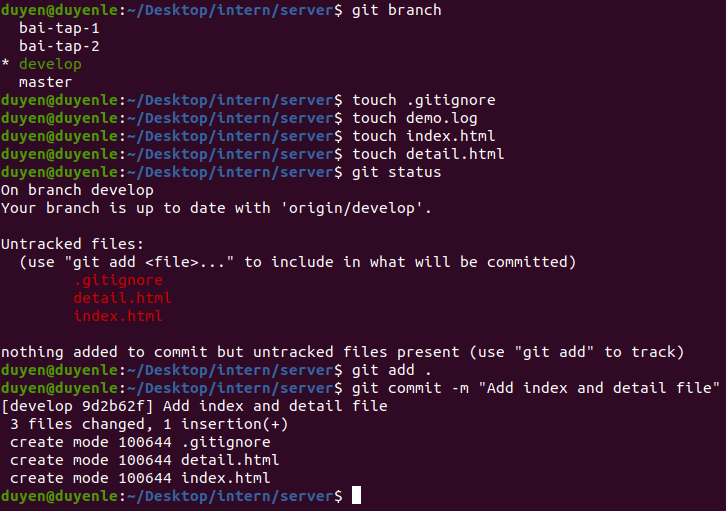
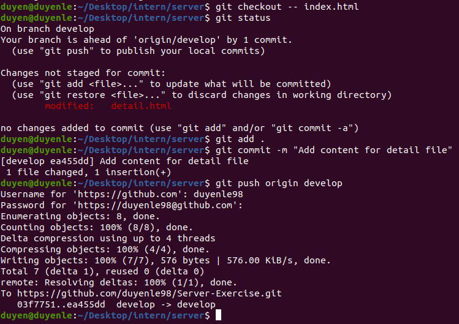
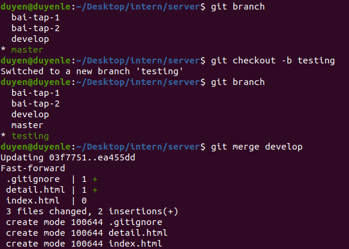

# Bai tap Server, Web Environment, Git

1. Config local user.name và user.email

git config user.name "duyenle98"

git config user.email "duyenle.24hdev@gmail.com"

2. Tạo một file README.md, commit và push

touch README.md

#### Tai branch master:

git status

git add README.md

git commit -m "Add README file"

git push origin master

3. Tạo một branch mới với name “demo” và sau đó đổi tên thành “develop”

#### Tao nhanh va push

git branch demo

git push origin demo

#### Checkout demo va doi ten thanh develop

git checkout demo

git branch -m develop

#### Xoá branch demo trên remote và push branch develop ở local lên

git push origin :demo develop

#### Reset upstream để local branch track remote branch cho branch develop

git push origin -u develop

4. Trên nhánh “develop”, tạo môt file demo.log, index.html, detail.html. Làm thế nào để git không tracking những file \*.log. Sau đó tạo một commit.

#### Tao cac file

touch demo.log

touch index.html

touch detail.html

#### Tao file .gitignore de khong tracking nhung file \*.log

touch .gitignore

#### Tao commit

git add .

git commit -m "Add index and detail file"

5. Thay đổi nội dung file index,html, detail.html và save. Sau đó revert lại nội dung commit gần nhất của 1 file index.html. Rồi tạo một commit mới, push.

#### Revert lại nội dung của file index.html

git checkout -- index.html

6. Từ master tạo một branch testing. Sau đó merge develop vào testing branch. Tạo một pull request merge testing vào master.

#### Tao branch testing va checkout testing

git chechout -b testing

#### Merge develop vao testing (hien dang o testing)

git merge develop

