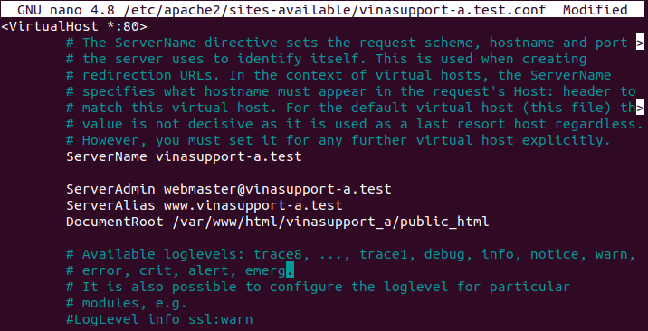

# Bai thuc hanh Web Environment

1. Cài đặt apache

sudo apt-get update

sudo apt-get install apache2 -y

2. Tao virtual host

#### Tao thu muc luu tru web cho moi website

sudo mkdir -p /var/www/html/vinasupport_a/public_html

sudo mkdir -p /var/www/html/vinasupport_b/public_html

#### Tạo file index.html cho 2 website va them noi dung

sudo nano /var/www/html/vinasupport_a/public_html/index.html

sudo nano /var/www/html/vinasupport_b/public_html/index.html

#### Phân quyền cho thư mục lưu trữ website

##### Xem thong tin User và Group của Apache Server

apachectl -S

##### Phan quyen

sudo chown -R www-data:www-data /var/www/html/vinasupport_a/public_html

sudo chown -R www-data:www-data /var/www/html/vinasupport_b/public_html

sudo chmod -R 755 /var/www/html

#### Tạo file Virtual hosts config cho mỗi website va them noi dung

sudo cp /etc/apache2/sites-available/000-default.conf /etc/apache2/sites-available/vinasupport-a.test.conf

sudo cp /etc/apache2/sites-available/000-default.conf /etc/apache2/sites-available/vinasupport-b.test.conf

#### Kích hoạt file config của Apache Virtual Hosts

sudo a2dissite 000-default.conf

sudo systemctl reload apache2

sudo a2ensite vinasupport-a.test.conf

sudo systemctl reload apache2

sudo a2ensite vinasupport-b.test.conf

#### Test config

3. Cấu hình thêm 1 virtual host có domain là google.com.vn (Hiện thị 1 trang html với dòng “Hello world“)

#### Hinh anh ket qua

