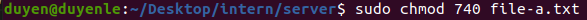
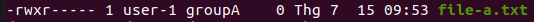

3. Tạo file-a cho user-1 được 3 quyền (read write execute) và groupA chỉ có quyền read

#### Create file-a.txt

touch file-a.txt

#### Doi chu so huu cua file-a.txt thanh user-1:groupA

sudo chown user-1:groupA file-a.txt

#### Cap quyen

sudo chmod 740 file-a.txt

#### Xem quyen

