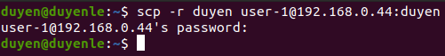

4. Connect SSH (dùng password) từ máy mình đến một máy bất kì trong mạng (upload 1 file từ máy mình và download 1 file về máy mình)

#### Connect

- username: user-1
- ip: 192.168.0.44

ssh user-1@192.168.0.44

#### Upload folder duyen

scp -r duyen user-1@192.168.0.44:duyen

#### Download folder hang

scp -r user-1@192.168.0.44:hang hang

