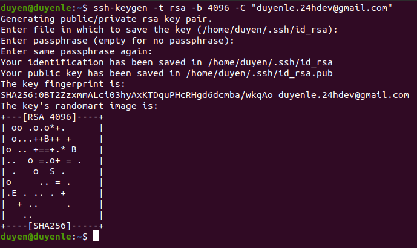
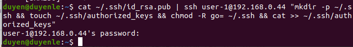

5. Tạo SSH key để đặng nhập vào server (một máy của bạn bất kì trong mạng) không dùng mật khẩu

#### Tao ssh key

ssh-keygen -t rsa -b 4096 -C "duyenle.24hdev@gmail.com"

#### Thêm public key vào authorized_key trên server

cat ~/.ssh/id_rsa.pub | ssh user-1@192.168.0.44 "mkdir -p ~/.ssh && touch ~/.ssh/authorized_keys && chmod -R go= ~/.ssh && cat >> ~/.ssh/authorized_keys"

#### Connect

ssh -i ~/.ssh/id_rsa user-1@192.168.0.44

